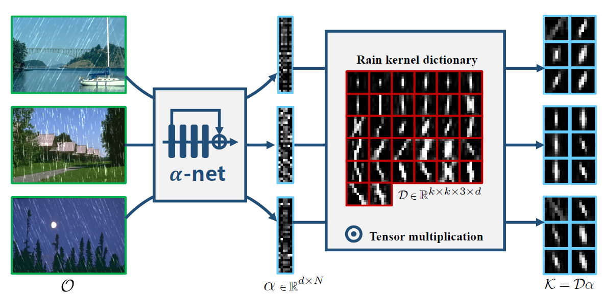

# RCDNet: An Interpretable Rain Convolutional Dictionary Network for Single Image Deraining
 
[Hong Wang](https://hongwang01.github.io/), Qi Xie, Qian Zhao, Yuexiang Li, Yong Liang, Yefeng Zheng, and [Deyu Meng](http://gr.xjtu.edu.cn/web/dymeng)

 [[Google Drive]](https://drive.google.com/file/d/1aWpc0xsGXqjyOBqL5NHweP-i0EccDnoV/view?usp=sharing)[[Arxiv]](https://arxiv.org/abs/2107.06808) 
 
We extend the previous work [RCDNet](https://github.com/hongwang01/RCDNet) to the training-testing mismatch case. In this work, we propose a dynamic rain kernel prediction mechanism, which makes the DRCDNet have the potential to obtain better generalization performance.


## Abstract
As a common weather, rain streaks adversely degrade the image quality and tend to negatively affect the performance
of outdoor computer vision systems. Hence, removing
rains from an image has become an important issue in the field.
To handle such an ill-posed single image deraining task, in this
paper, we specifically build a novel deep architecture, called rain convolutional dictionary network (RCDNet), which embeds the
intrinsic priors of rain streaks and has clear interpretability. In specific, we first establish a RCD model for representing rain streaks and utilize the proximal gradient descent technique to design an iterative algorithm only containing simple operators for solving the model. By unfolding it, we then build the RCDNet in which every network module has clear physical meanings and corresponds to each operation involved in the algorithm. This good interpretability greatly facilitates an easy visualization and analysis on what happens inside the network and why it works well in inference process. Moreover, taking into account the domain gap issue in real scenarios, we further design a novel dynamic RCDNet, where the rain kernels can be dynamically inferred corresponding to input rainy images so as to ensure a fine generalization performance in the inconsistent scenarios of rain types between training and testing data. By end-toend training such an interpretable network, all involved rain kernels and proximal operators can be automatically extracted, faithfully characterizing the features of both rain and clean background layers, and thus naturally lead to better deraining performance. Comprehensive experiments implemented on a series of representative synthetic and real datasets substantiate the superiority of our method, especially on its well generality to diverse testing scenarios and good interpretability for all its modules, as compared with state-of-the-art single image derainers both visually and quantitatively.

## Motivation


## Dynamic Rain Kernel Inference


## Dataset

1. Download Rain100L (training data: train/small/, testing data: test/small), Rain100H (training data: train/small/, testing data: test/small), Rain1400 (training data: train/small/, testing data: test/small), SPA-Data (testing data: test/small) from the  [[NetDisk]](https://pan.baidu.com/s/1yV4ih7C4Xg0iazqSBB-U1Q) (pwd:uz8h) and put them into the folder "data".

2. Dense10, Sparse10, and Internet-Data can be collected from [], and [], respectively.


## Training
Taking the training on Rain100L as an example:
```
$ cd DRCDNet
$ python train.py  --data_path data/Rain100L/train/small/rain/ --gt_path data/Rain100L/train/small/norain/ --log_dir logs --model_dir models --gpu_id 0 
```

## Pretrained_Model

1. Training on Rain100L Training Data: ``Pretrained_Model/Rain100L/model_100.pt''

2. Training on Rain100H Training Data: ``Pretrained_Model/Rain100H/model_100.pt''

3. Training on Rain1400 Training Data:  ``Pretrained_Model/Rain1400/model_100.pt''

4. Training on Rain100L Training Data and Rain1400 Training Data:  ``Pretrained_Model/Rain100L+Rain1400/model_100.pt''

5. Training on Rain100L Training Data and Rain100H Training Data:  ``Pretrained_Model/Rain100L+Rain100H/model_100.pt''


All these pretrained_models can be downloaded from [[Google Drive]](https://drive.google.com/drive/folders/1HAFLQfjj--sd-Cfo9HibsUCTjxU9AcMx?usp=drive_link)


## Training-Testing Match Case:
1. Rain100L -->Rain100L 

```
python test.py --data_path data/Rain100L/test/small/rain/ --model_dir pretrained_model/Rain100L/ --save_path derained/match/Rain100L/ --gpu_id 0
```

2. Rain100H --> Rain100H 

```
python test.py --data_path data/Rain100H/test/small/rain/ --model_dir pretrained_model/Rain100H/ --save_path derained/match/Rain100H/  --gpu_id 0
```

3. Rain1400 --> Rain1400

```
python test.py --data_path data/Rain1400/test/small/rain/ --model_dir pretrained_model/Rain1400/ --save_path derained/match/Rain1400/  --gpu_id 0
```

All the derained  results can be downloaded from [[NetDisk]](https://pan.baidu.com/s/18YlHicICTsdWye8pB_jVSw?pwd=drcd) (pwd:drcd)

## Training-Testing Mismatch Case:
1. Rain100H --> Dense10

```
python test.py --data_path data/Dense10/test/small/rain/ --model_dir pretrained_model/Rain100H/ --save_path derained/mismatch/Rain100H_Dense10/  --gpu_id 0
```

2. Rain100H --> Sparse10

```
python test.py --data_path data/Sparse10/test/small/rain/ --model_dir pretrained_model/Rain100H/ --save_path derained/mismatch/Rain100H_Sparse10/  --gpu_id 0
```

3. Rain100L --> SPA-Data

```
python test.py --data_path data/SPA-Data/test/small/rain/ --model_dir pretrained_model/Rain100L/ --save_path derained/mismatch/Rain100L_SPA-Data/  --gpu_id 0
```

4. Rain100L+Rain1400 -->SPA-Data

```
python test.py --data_path data/SPA-Data/test/small/rain/ --model_dir pretrained_model/Rain100L+Rain1400/ --save_path derained/mismatch/Rain100L+Rain1400_SPA-Data/  --gpu_id 0
```

5. Rain100H --> Internet-Data

```
python test.py --data_path data/Internet-Data/test/small/rain/ --model_dir pretrained_model/Rain100H/ --save_path derained/mismatch/Rain100H_Internet-Data/  --gpu_id 0
```

6. Rain100L+Rain100H --> Internet-Data

```
python test.py --data_path data/Internet-Data/test/small/rain/ --model_dir pretrained_model/Rain100H/ --save_path derained/mismatch/Rain100H_Internet-Data/  --gpu_id 0
```

All the derained  results can be downloaded from [[NetDisk]](https://pan.baidu.com/s/18YlHicICTsdWye8pB_jVSw?pwd=drcd) (pwd:drcd)


## Citations

```
@article{wang2023rcdnet,
  title={RCDNet: An interpretable rain convolutional dictionary network for single image deraining},
  author={Wang, Hong and Xie, Qi and Zhao, Qian and Li, Yuexiang and Liang, Yong and Zheng, Yefeng and Meng, Deyu},
  journal={IEEE Transactions on Neural Networks and Learning Systems},
  year={2023}
}
```

## Contact
If you have any question, please feel free to concat Hong Wang (Email: hongwang9209@hotmail.com)
